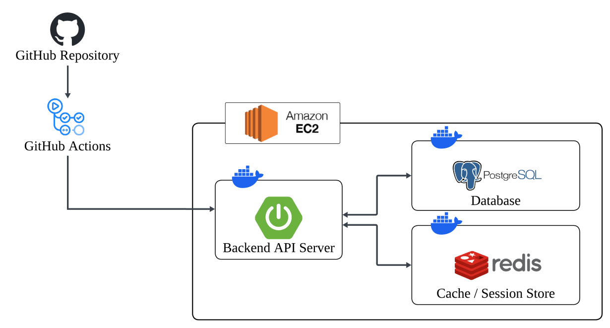

# 003. 인프라 명세

> **이 문서를 보면**: 어디에 어떻게 배포되는지, CI/CD는 어떻게 돌아가는지, 어떤 환경변수가 필요한지 파악 가능.
>
> **언제 다시 보나요**: 배포 시, 환경변수 추가할 때, 신규 인프라 요소 도입 시.

---

## 한 줄 요약

**GitHub Actions**로 빌드하여 **AWS EC2** 위의 **Docker 컨테이너 3개** (Spring Boot / PostgreSQL / Redis)로 배포한다.

---

## 목차

- [1. 배포 아키텍처](#1-배포-아키텍처)
- [2. 기술 스택](#2-기술-스택)
- [3. 환경별 Profile](#3-환경별-profile)
- [4. 환경 변수](#4-환경-변수)
- [5. 보안 설정](#5-보안-설정)
- [6. CI/CD 파이프라인](#6-cicd-파이프라인)

---

## 1. 배포 아키텍처



### 구성 요소

| 구성 | 역할 |
|------|------|
| GitHub Repository | 소스 코드 저장 |
| GitHub Actions | CI/CD 파이프라인 (빌드 → 배포) |
| AWS EC2 | Docker 호스트 |
| Backend API Server (Docker) | Spring Boot 애플리케이션 |
| PostgreSQL (Docker) | 주 데이터베이스 |
| Redis (Docker) | 캐시 / 세션 스토어 |

### 구조 요약

- 모든 런타임 서비스는 **Docker 컨테이너**로 실행
- 단일 EC2 인스턴스에 **Spring Boot + PostgreSQL + Redis** 컨테이너가 함께 올라감
- **GitHub Actions**가 빌드 후 EC2로 배포

---

## 2. 기술 스택

| 구분 | 기술 | 비고 |
|------|------|------|
| Language | Java 17 | |
| Framework | Spring Boot 3.x | |
| Security | Spring Security + JWT (jjwt) | 매 요청 DB 권한 재검증 |
| ORM | JPA / Hibernate | |
| DB | PostgreSQL 15+ | Docker 컨테이너 |
| Cache / Session | Redis 7+ | Docker 컨테이너 |
| Build | Gradle 8.x | |
| API 문서 | springdoc-openapi (Swagger) | |
| AI | Google Gemini 1.5 Flash | REST 호출 |
| 컨테이너 | Docker + docker-compose | |
| CI/CD | GitHub Actions | |
| 서버 | AWS EC2 (Ubuntu 22.04) | |

---

## 3. 환경별 Profile

| 환경 | Profile | DB | Redis | 실행 방식 |
|------|---------|-----|-------|----------|
| 로컬 개발 | `local` | PostgreSQL (Docker) | Redis (Docker) | `./gradlew bootRun` (spring-boot-docker-compose로 자동 기동) |
| 테스트 | `test` | H2 In-Memory | (Mock 또는 없음) | JUnit 단위/통합 테스트 |
| 운영 | `prod` | PostgreSQL (Docker) | Redis (Docker) | EC2에서 `docker compose up -d` |

### Profile 활성화

```bash
# 로컬 (기본값)
./gradlew bootRun

# 운영 (EC2)
SPRING_PROFILES_ACTIVE=prod
```

---

## 4. 환경 변수

### 4-1. 운영 필수 환경 변수

| 변수명 | 설명 |
|--------|------|
| `SPRING_PROFILES_ACTIVE` | 프로필 선택 (`prod`) |
| `DB_HOST` | PostgreSQL 컨테이너 호스트명 |
| `DB_PORT` | PostgreSQL 포트 |
| `DB_NAME` | DB 이름 |
| `DB_USERNAME` | DB 사용자 |
| `DB_PASSWORD` | DB 비밀번호 |
| `REDIS_HOST` | Redis 컨테이너 호스트명 |
| `REDIS_PORT` | Redis 포트 |
| `REDIS_PASSWORD` | Redis 비밀번호 |
| `JWT_SECRET` | JWT 서명 키 (256bit 이상) |
| `GEMINI_API_KEY` | Google AI Studio 발급 API 키 |

### 4-2. 로컬 개발 (.env)

`.env` 파일로 Docker Compose 변수 관리.

```env
POSTGRES_DB=delivery
POSTGRES_USER=delivery
POSTGRES_PASSWORD=1234
REDIS_PASSWORD=1234
```

> `.env`는 **Git에 커밋 금지** (`.gitignore` 포함됨). 템플릿은 `.env.example` 참고.

---

## 5. 보안 설정

### 인증 / 인가

- JWT Access Token 헤더: `Authorization: Bearer {token}`
- 서명 알고리즘: HS256
- 비밀번호 저장: BCrypt 해시
- 매 요청 시 JWT payload의 `role`과 DB의 현재 `role` 비교
- Redis 캐싱으로 권한 재검증 부하 완화 (선택)

### 민감 정보 관리

- `GEMINI_API_KEY`, `DB_PASSWORD`, `JWT_SECRET`, `REDIS_PASSWORD`는 **환경 변수로만** 관리
- 코드/Git에 하드코딩 금지
- `.env.example`에는 변수명만 공개

### 입력 검증

- 모든 Request DTO에 Spring Validation 적용
- 예: `@NotBlank`, `@Size(min=4, max=10)`, `@Pattern(regexp="...")`

---

## 6. CI/CD 파이프라인

GitHub Actions로 브랜치 푸시 시 빌드·배포가 이루어지도록 구성한다.

> 세부 워크플로우 및 Secrets 구성은 실제 구현 시 확정.

---

## 관련 문서

- [000. 프로젝트 개요](./000-overview.md)
- [002. 데이터 명세](./002-data-spec.md)
- [006. 팀 협업 컨벤션](./006-conventions.md)
